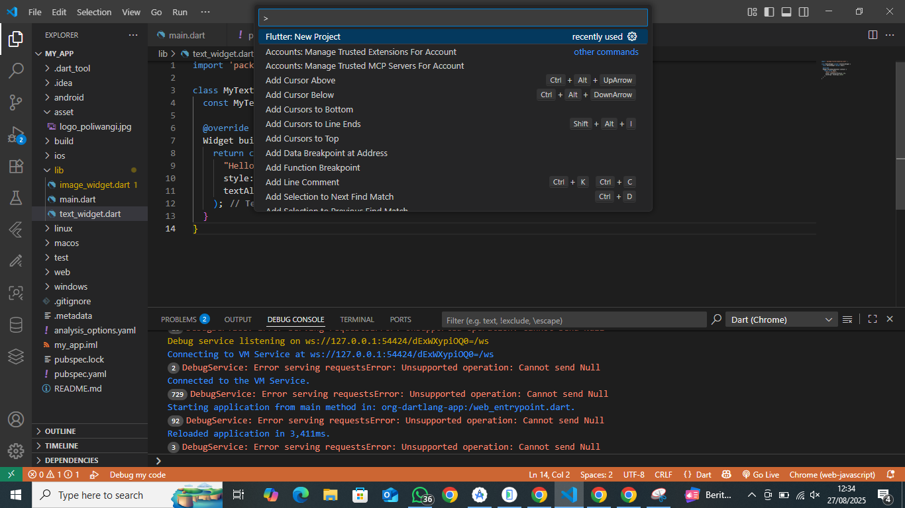
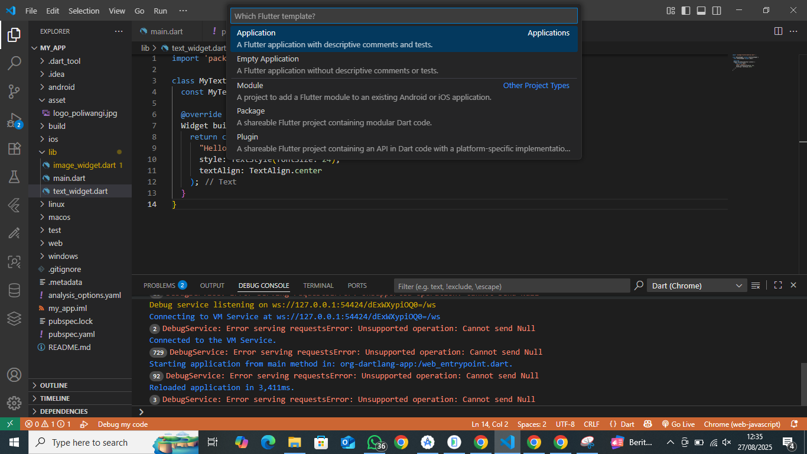
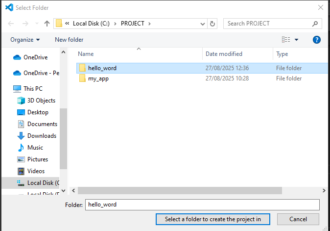
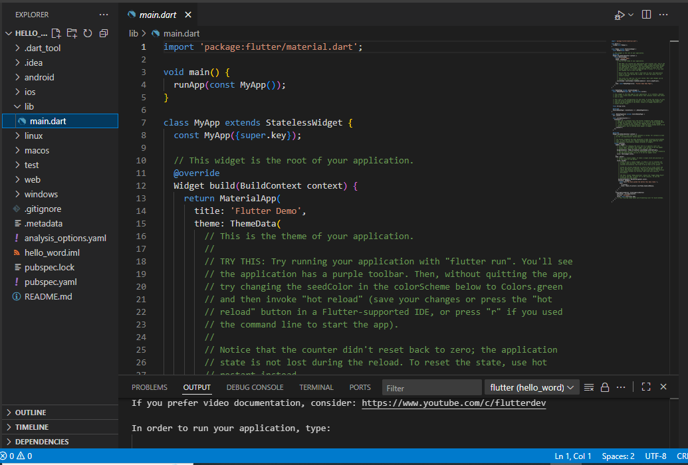
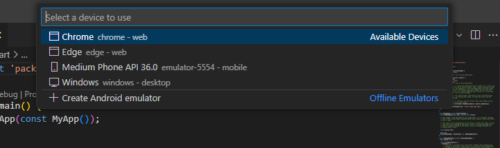
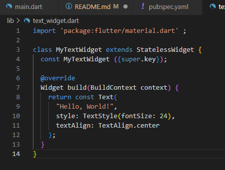
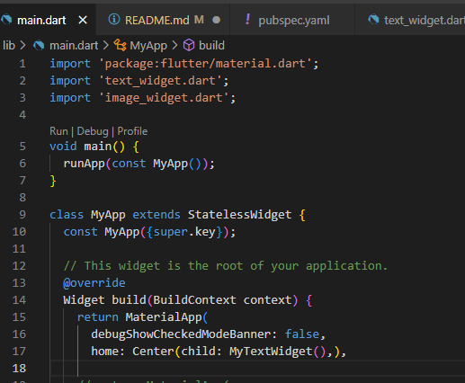
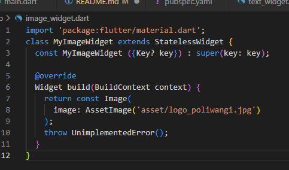
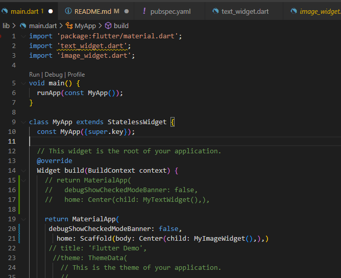

# hello_word

Laporan Praktikum Flutter Fundamental

##Praktikum 1 membuat project flutter baru
Lanngkah 1 Buka vsc kliK manage pada pojok bawah lalu pilih command pallete dan kettikan flutter

Lalu pilih aplication

Langkah 2 buat folder dengan nama hello_world

Lalu berikan penamaan project hello_world dan tekan enter, tunggu hingga proses pembuatan project baru selesai

Langkah 3 jika sudah berhassil maka tampilan yang akan ada seperti pada gambar

Langkah 4 pilih chrome untuk menampilkan hasil

##Menerapkan widget dasar

Membuat text_widget : buat file baru pada folder lib dengan nama text_widget 
berikut syntax untuk text_widget

Berikut main dan hasilnya

Membuat image_widget : buat file baru pada folder lib dengan nama image_widget
berikut syntax untuk image widget

Berikut main dan hasilnya

